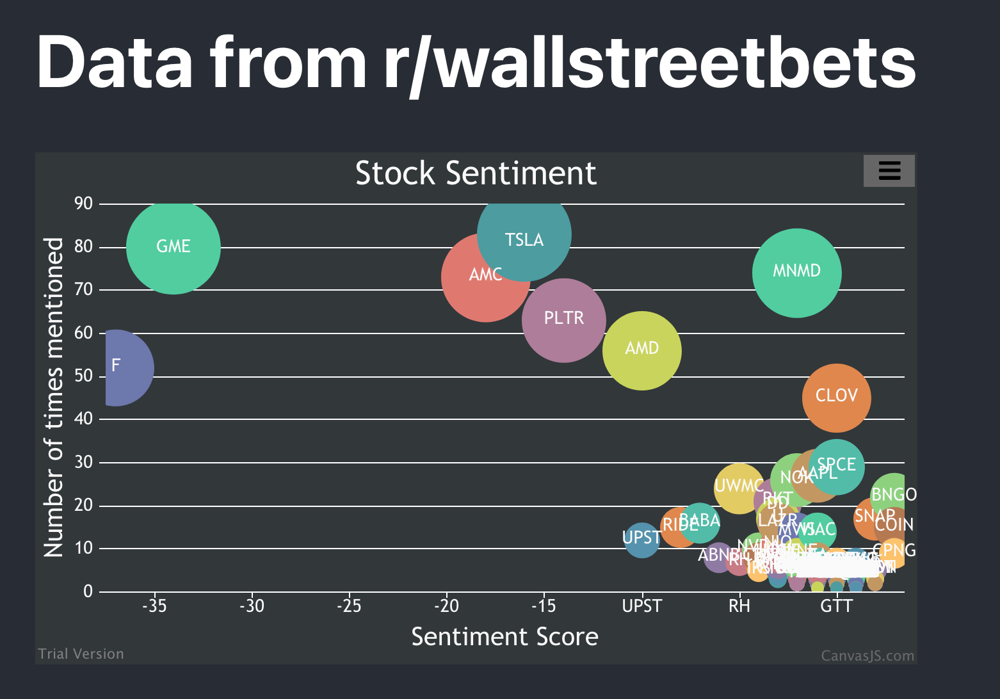

# stock-visualizer
An app that gathers data from Reddit and visualizes that data in a bubble graph format

Working locally for now, but will make this work in the cloud in the future

# Description
The app listens to Reddit for comments from r/wallstreetbets. It cross references those conversations with known stock tickers to analyze the amount of interest in the stock

It also analyzes the sentiment of the post using AWS Comprehend and stores the total number of Positive, Negative, and Neutral conversation about that particular stock
The front-end component takes that data and graphs it using a bubble graph.

The x-axis represents the sentiment score (calculated by simply subtracting the negative sentiment score from the positive), the y-axis and z-axis (how big the bubble is) both represent the amount of times the stock has been mentioned.

# Setup
1: Create a Reddit app [here](https://ssl.reddit.com/prefs/apps/), you can view [this article](https://techradicals.wordpress.com/2020/08/09/how-to-create-a-simple-reddit-bot/) for more information on how to set the bot up
2: Copy the client secret and the clientId after the app is set up
3: Set you .env file up with you the client secret, clientId, Reddit username, and Reddit password
4: Set up an AWS account if you do not have one already
5: Install the AWS CLI if you do not already have it installed. You can find instructions on how to do that [here](https://docs.aws.amazon.com/cli/latest/userguide/install-cliv2.html)
6: Configure the AWS CLI with your AWS credentials by running `aws configure`. You will need you AWS_ACCESS_KEY_ID and AWS_SECRET_ACCESS_KEY.
7: `cd` into the `service` directory and run `yarn` 
8: `cd` into the `ui` directory and run `yarn`
9: Run `yarn start` in the `ui` directory
10: Run `yarn start` in the `servcie` directory

# Limitations
Obviously, writing to a file is not ideal. I intend to deploy this and use a data store instead, as well as host the app (recieving data via Websockets perhaps).

Because the service is writing to a file without mutexes, and the listeners can recieve data independently of one another, it's possible that two processes are trying to write to the file at the same time, with one overriding the other due to it having stale data.

The service only counts mentions of stocks if the stock ticker is mentioned in all uppercase, it does not count the stock as mentioned if the company name is mentioned, rather than the stock ticker (e.g. TLSA or $TLSA will be counted, but tlsa or Tesla will not be).

The reason for this is because there was too much noise when analyzing the data in a case-insensitive way. There are many stock tickers that overlap with commonly used vocabularly. I tried to ignore those common words, but there were too many to ignore, and I could never be sure as to if it was actually a stock ticker, and I was ignoring it, or if it was just a normal conversation and I accidentally picked it up.

This limitation still exists; for example, if someone is typing in all caps `I LOVE DOGS`, the company Lovesac (with the ticker LOVE) would get a mention, as well as a positive sentiment score.

There's not much you can do to avoid this without additional ML analysis to determine the meaning of the comment within the larger context.